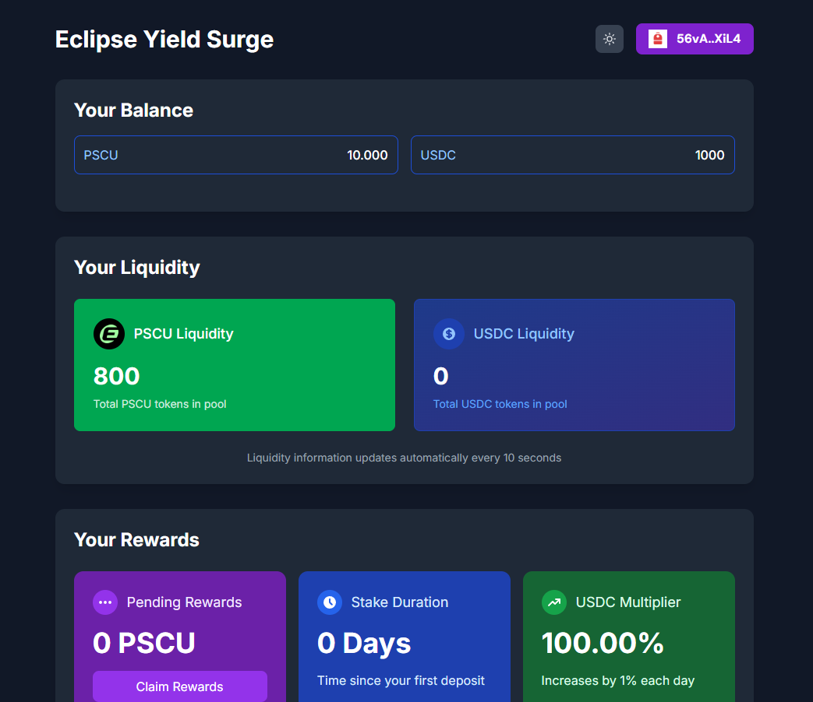
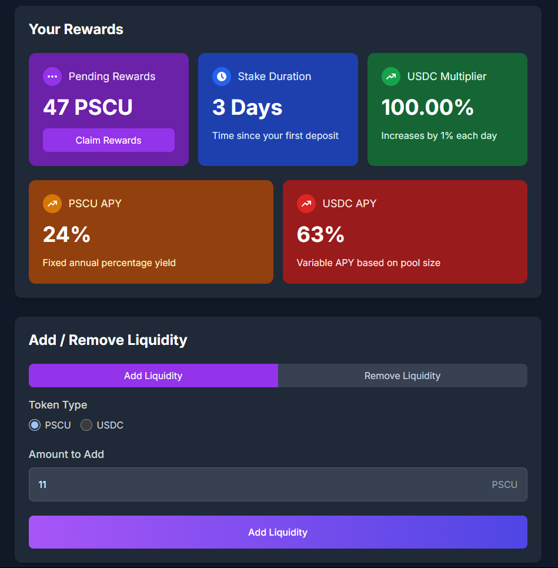

## Contents
1. Project Details
2. Development Rules
3. Technical Requirements
4. Technical Details
5. Token Information

## 1. Project Details
[https://www.encode.club/mammothon]
This project is developed as part of the Encode Mammothon hackathon. The idea proposed by the Eclipse.xyz team— "Build a Yield Surge Protocol (YSP). This is a protocol designed to rapidly bootstrap liquidity on Eclipse by drastically lowering the barrier to entry and incentivizing early adopters."— will be implemented.

## 2. Development Rules
- Eclipse.xyz is an L2 solution that uses SVM as the execution layer, Ethereum as the settlement layer, and Celestia as the data availability layer. Our project has been deployed on the Eclipse mainnet.
- Eclipse mainnet RPC URL: https://mainnetbeta-rpc.eclipse.xyz
- Eclipse mainnet explorer: https://eclipsescan.xyz/
- Our project rewards early liquidity providers with PSCU tokens as an incentive for participation.
- PSCU Token Address: Cpe4nvqZ9ym6C2BgnSYJ3Pbup7sGmT9HG4oGPhJcPWxh
- Users can provide liquidity using USDC and PSCU tokens. In future versions, liquidity pools for TIA, ETH, and SOL will be added.
- Reward Distribution & APY
- A total of 100,000 PSCU tokens are distributed daily as rewards, based on the total liquidity provided.
- To incentivize early and long-term liquidity providers, an additional 1% liquidity multiplier is applied for each day liquidity is held in the system.
- Example: If you deposit 10,000 USDC and keep it in the system for 3 days, the rewards are calculated as follows:
- Day 1: 10,000 x 1.01 = 10,100 USDC liquidity effect
- Day 2: 10,100 x 1.01 = 10,201 USDC liquidity effect
- Day 3: 10,201 x 1.01 = 10,303 USDC liquidity effect
- Users can claim rewards at any time.
- No unstake lock period—liquidity can be withdrawn freely.
- PSCU tokens can also be staked as liquidity with a fixed 24% APY.
- When distributing rewards:
- The staked PSCU tokens receive a fixed daily (24% / 365) reward from the pool.
- The remaining pool balance is distributed as rewards for USDC liquidity providers.

## 3. Technical Requirements
- Wallet: Backpack Wallet (Eclipse network only supports Backpack Wallet)
- Frontend: React
- Smart Contracts: Solana smart contracts compatible with SVM (Solana Virtual Machine), as required by Eclipse.
- Node.js Version: v18+ (recommended)

## Frontend - UI
-Project Setup

- Initialize React project
- Install necessary dependencies
- Integrate Eclipse Wallets
- UI Components

- Wallet connection component
- Token add liquidity/remove liquidity form
- Display user balances
- APY & reward calculation display
- List of staked tokens
- View users earned rewards
- Smart Contract Integration

- Interaction with token contracts
- Stake/unstake transactions
- Reward calculation & claiming
- Smart Contracts - HWP
- Staking (Liquidity) Contract

- Functions for staking/unstaking tokens
- Reward calculation logic
- First 10 days: Daily 1M PSCU rewards
- After 10 days: Daily reward decreases by 100k per day (minimum 100k)
- Fixed 24% APY for PSCU staking
- Reward distribution function

## 5. Program & Token Information
- Program ID: 78V1S4FQ256qFjNCS1wbsrDem9AjCfeZdU3cwajdq9SG
- PSCU Token Address: Cpe4nvqZ9ym6C2BgnSYJ3Pbup7sGmT9HG4oGPhJcPWxh
